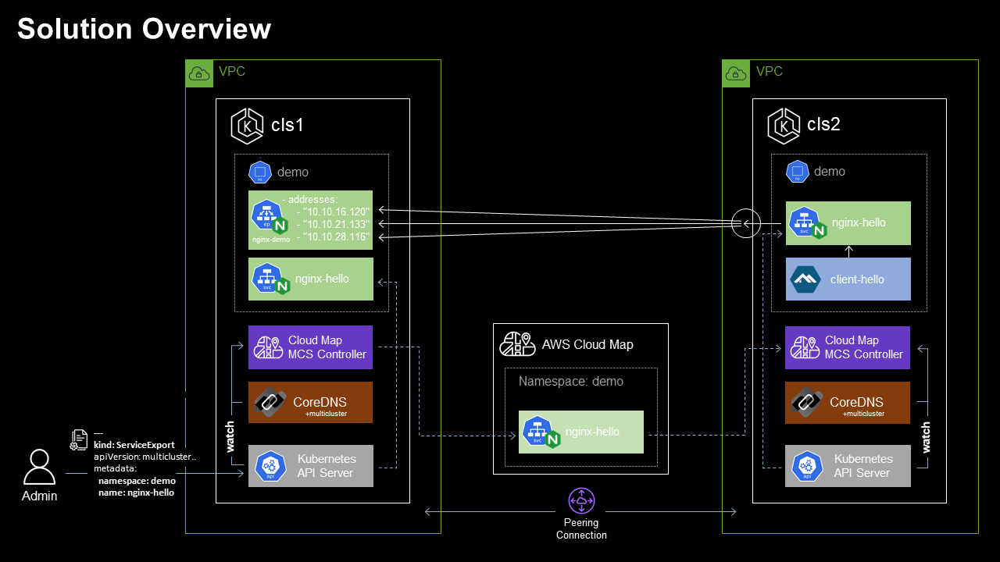

# Kubernetes Multi-cluster Service Discovery using the AWS Cloud Map MCS Controller

> *This repository provides an overview of the Kubernetes Multi-Cluster Service API, and the AWS open source implementation of the mcs-api specification - the [AWS Cloud Map MCS Controller for K8s](https://github.com/aws/aws-cloud-map-mcs-controller-for-k8s). This repository also provides a detailed work instruction and associated artefacts required for the end-end implementation of the AWS Cloud Map MCS Controller across multiple EKS clusters in support of seamless, multi-cluster workload deployments.* 

## Introduction

Kubernetes, with it's implementation of the cluster construct has simplified the ability to schedule workloads across a collection of VMs or nodes. Declarative configuration, immutability, auto-scaling, and self healing have vastly simplified the paradigm of workload management within the cluster - which has enabled teams to move at increasing velocities. 

As the rate of Kubernetes adoption continues to increase, there has been a corresponding increase in the number of use cases that require workloads to break through the perimeter of the single cluster construct. Requirements concerning workload location/proximity, isolation, and reliability have been the primary catalyst for the emergence of deployment scenarios where a single logical workload will span multiple Kubernetes clusters:

- **Location** based concerns include network latency requirements (e.g. bringing the application as close to users as possible), data gravity requirements (e.g. bringing elements of the application as close to fixed data sources as possible), and jurisdiction based requirements (e.g. data residency limitations imposed via governing bodies);
- **Isolation** based concerns include performance (e.g. reduction in "noisy-neighbor" in mixed workload clusters), environmental (e.g. by staged or sandboxed workload constructs such as "dev", "test", and "prod" environments), security (e.g. separating untrusted code or sensitive data), organisational (e.g. teams fall under different business units or management domains), and cost based (e.g. teams are subject to separate budgetary constraints);
- **Reliability** based concerns include blast radius and infrastructure diversity (e.g. preventing an application based or underlying infrastructure issue in one cluster or provider zone from impacting the entire solution), and scale based (e.g. the workload may outgrow a single cluster)
  
  




Multi-cluster application architectures tend to be designed to either be **replicated** in nature - with this pattern each participating cluster runs a full copy of each given application; or alternatively they implement more of a **group-by-service** pattern where the services of a single application or system are split or divided amongst multiple clusters.

When it comes to the configuration of Kubernetes (and the surrounding infrastructure) to support a given multi-cluster application architecture - the space has evolved over time to include a number of approaches. Implementations tend draw upon a combination of components at various levels of the stack, and generally speaking they also vary in terms of the "weight" or complexity of the implementation, number and scope of features offered, as well as the associated management overhead. In simple terms these approaches can be loosely grouped into two main categories:

* **Network-centric** approaches focus on network interconnection tooling to implement connectivity between clusters in order to facilitate cross-cluster application communication. The various network-centric approaches include those that are tightly coupled with the CNI (e.g. Cillium Mesh), as well as more CNI agnostic implementations such as Submariner and Skupper. Service mesh implementations also fall into the network-centric category, and these include Istio’s multi-cluster support, Linkerd service mirroring, Kuma from Kong, AWS App Mesh, and Consul’s mesh gateway. There are also various multi-cluster ingress approaches, as well as virtual-kubelet based approaches including Admiralty, Tensile-kube, and Liqo.
* **Kubernetes-centric** approaches focus on supporting and extending the core Kubernetes primitives in order to support multi-cluster use cases. These approaches fall under the stewardship of the Kubernetes [Multicluster Special Interest Group](https://github.com/kubernetes/community/tree/master/sig-multicluster) whose charter is focused on designing, implementing, and maintaining API’s, tools, and documentation related to multi-cluster administration and application management. Subprojects include:
  * **[kubefed](https://github.com/kubernetes-sigs/kubefed)** (Kubernetes Cluster Federation) which implements a mechanism to coordinate the configuration of multiple Kubernetes clusters from a single set of APIs in a hosting cluster. kubefed is considered to be foundational for more complex multi-cluster use cases such as deploying multi-geo applications, and disaster recovery.
  * **[work-api](https://github.com/kubernetes-sigs/work-api)** (Multi-Cluster Works API) aims to group a set of Kubernetes API resources to be applied to one or multiple clusters together as a concept of “work” or “workload” for the purpose of multi-cluster workload lifecycle mangement.
  * **[mcs-api](https://github.com/kubernetes-sigs/mcs-api)** (Multi-cluster Services APIs) implements a new API to extend the single-cluster bounded Kubernetes service concept to function across multiple clusters.

### About the Multi-cluster Service API

Kubernetes' familiar [Service](https://cloud.google.com/kubernetes-engine/docs/concepts/service) object lets you discover and access services within the boundary of a single Kubernetes cluster. The mcs-api implements a Kubernetes-native extension to the Service API, extending the scope of the service resource concept beyond the cluster boundary - providing a mechanism to weave multiple clusters together using standard (and familiar) DNS based service discovery.

> *[KEP-1645: Multi-Cluster Services API](https://github.com/kubernetes/enhancements/tree/master/keps/sig-multicluster/1645-multi-cluster-services-api#kep-1645-multi-cluster-services-api) provides the formal description of the Multi Cluster Service API. KEP-1645 doesn't define a complete implementation - it serves to define how an implementation should behave.At the time of writing the mcs-api version is: `multicluster.k8s.io/v1alpha1`*

The primary deployment scenarios covered by the mcs-api include:

- **Different services each deployed to separate clusters:** I have 2 clusters, each running different services managed by different teams, where services from one team depend on services from the other team. I want to ensure that a service from one team can discover a service from the other team (via DNS resolving to VIP), regardless of the cluster that they reside in. In addition, I want to make sure that if the dependent service is migrated to another cluster, the dependee is not impacted.
- **Single service deployed to multiple clusters:** I have deployed my stateless service to multiple clusters for redundancy or scale. Now I want to propagate topologically-aware service endpoints (local, regional, global) to all clusters, so that other services in my clusters can access instances of this service in priority order based on availability and locality.

The mcs-api is able to support these use cases through the described properties of a "ClusterSet", which is a group of clusters with a high degree of mutual trust and shared ownership that share services amongst themselves - along with two additional API objects: the `ServiceExport` and the `ServiceImport`.

Services are not visible to other clusters in the ClusterSet by default, they must be explicitly marked for export by the user. Creating a `ServiceExport` object for a given service specifies that the service should be exposed across all clusters in the ClusterSet. The mcs-api implementation (typically a controller) will automatically generate a corresponding `ServiceImport` object (which serves as the in-cluster representation of a multi-cluster service) in each importing cluster - for consumer workloads to be able to locate and consume the exported service.

DNS-based service discovery for `ServiceImport` objects is facilitated by the [Kubernetes DNS-Based Multicluster Service Discovery Specification](https://github.com/kubernetes/enhancements/pull/2577) which extends the standard Kubernetes DNS paradigms by implementing records named by service and namespace for `ServiceImport` objects, but as differentiated from regular in-cluster DNS service names by using the special zone `.clusterset.local`. I.e. When a `ServiceExport` is created, this will cause a FQDN for the multi-cluster service to become available from within the ClusterSet. The domain name will be of the format `<service>.<ns>.svc.clusterset.local`.

#### AWS Cloud Map MCS Controller for Kubernetes

The [AWS Cloud Map MCS Controller for Kubernetes](https://github.com/aws/aws-cloud-map-mcs-controller-for-k8s) (MCS-Controller) is an open source project that implements the multi-cluster services API specification. 

The MCS-Controller is a controller that syncs services across clusters and makes them available for multi-cluster service discovery and connectivity. The implementation model is decentralsised, and utilises AWS Cloud Map as registry for management and distribution of multi-cluster service data.

At the time of writing, the MCS-Controller release version is [v0.2.2](https://github.com/aws/aws-cloud-map-mcs-controller-for-k8s/releases/tag/v0.2.2). Milestones are currently in place to bring the project up to [v1.0 (GA)](https://github.com/aws/aws-cloud-map-mcs-controller-for-k8s/milestones) during the 2nd half of CY2022, which will include full compliance with the mcs-api specification, support for Multiple AWS accounts, headless services, and Cloud Map client-side traffic shaping.

#### AWS Cloud Map

[AWS Cloud Map](https://aws.amazon.com/cloud-map) is a cloud resource discovery service that Cloud Map allows applications to discover web-based services via AWS SDK, API calls, or DNS queries. Cloud Map is a fully managed service which eliminates the need to set up, update, and manage your own service discovery tools and software.


## Tutorial

### Overview

Let's consider a deployment scenario where we provision a Service into a single EKS cluster, then make the service available from within a second EKS cluster using the AWS Cloud Map MCS Controller.

> *This tutorial will take you through the end-end implementation of the solution as outlined herein, including a functional implementation of the AWS Cloud Map MCS Controller across x2 EKS clusters situated in separate VPCs.*

#### Solution Baseline


In reference to the **Solution Baseline** diagram:

- We have x2 EKS clusters (cls1 & cls2), each deployed into separate VPCs within a single AWS region.
  - cls1 VPC CIDR: 10.10.0.0/16, Kubernetes service IPv4 CIDR: 172.20.0.0/16
  - cls2 VPC CIDR: 10.12.0.0/16, Kubernetes service IPv4 CIDR: 172.20.0.0/16
- VPC peering is configured to permit network connectivity between workloads within each cluster.
- The CoreDNS multicluster plugin is deployed to each cluster.
- The AWS Cloud Map MCS Controller for Kubernetes is deployed to each cluster.
- Clusters cls1 & cls2 are both configured as members of the same mcs-api clusterset.
- Clusters cls1 & cls2 are both provisioned with the namespace `demo`.
- Cluster cls1 has a `ClusterIP` Service `nginx-hello` deployed to the `demo` namespace which frontends a x3 replica Nginx deployment `nginx-demo`.
  - Service | nginx-hello: 172.20.150.33:80
  - Endpoints | nginx-hello: 10.10.11.140:80,10.10.16.197:80,10.10.22.87:80

#### Service Provisioning

With the required dependencies in place, the admin user is able to create a `ServiceExport` object in cls1 for the `nginx-hello` Service, such that the MCS-Controller implementation will automatically provision a corresponding `ServiceImport` in cls2 for consumer workloads to be able to locate and consume the exported service.


In reference to the **Service Provisioning** diagram:

1. The administrator submits the request to the cls1 Kube API server for a `ServiceExport` object to be created for ClusterIP Service `nginx-hello` in the `demo` Namespace.
2. The MCS-Controller in cls1, watching for `ServiceExport` object creation provisions a corresponding `nginx-hello` service in the Cloud Map `demo` namespace. The Cloud Map service is provisioned with sufficient detail for the Service object and corresponding Endpoint Slice to be provisioned within additional clusters in the ClusterSet.
3. The MCS-Controller in cls2 responds to the creation of the `nginx-hello` Cloud Map Service by provisioning the `ServiceImport` object and corresponding `EndpointSlice` objects via the Kube API Server.
4. The CoreDNS multicluster plugin, watching for `ServiceImport` and `EndpointSlice` creation provisions corresponding DNS records within the `.clusterset.local` zone.

#### Service Consumption


In reference to the **Service Consumption** diagram:

1. The `client-hello` pod in Cluster 2 needs to consume the `nginx-hello` service, for which all Endpoints are deployed in Cluster 1. The `client-hello` pod requests the resource http://nginx-hello.demo.svc.clusterset.local:80. DNS based service discovery [1b] responds with the IP address of the local `nginx-hello` `ServiceExport` Service `ClusterSetIP`.
2. Requests to the local `ClusterSetIP` at `nginx-hello.demo.svc.clusterset.local` are proxied to the Endpoints located on Cluster 1.

> *Note: In accordance with the mcs-api specification, a multi-cluster service will be imported by all clusters in which the service's namespace exists, meaning that each exporting cluster will also import the corresponding multi-cluster service. As such, the `nginx-hello` service will also be accessible via `ServiceExport` Service `ClusterSetIP` on Cluster 1. Identical to Cluster 2, the `ServiceExport` Service is resolvable by name at `nginx-hello.demo.svc.clusterset.local`.*

### Implementation

### Solution Baseline 

To prepare your environment to match the Solution Baseline deployment scenario, the following prerequisites should be addressed.

#### Clone the `cloud-map-mcs-controller` git repository

Sample configuration files will be used through the course of the tutorial, which have been made available in the `cloud-map-mcs-controller` repository.

Clone the repository to the host from which you will be bootstrapping the clusters:

```bash
git clone https://gitlab.com/byteQualia/cloud-map-mcs-controller.git
```

> *Note: All commands as provided should be run from the root directory of the cloned git repository.*

> *Note: Certain values located within the provided configuration files have been configured for substitution with OS environment variables. Work instructions below will identify which environment variables should be set before issuing any commands which will depend on variable substitution.*

#### Create EKS Clusters

x2 EKS clusters should be provisioned, each deployed into separate VPCs within a single AWS region.

- VPCs and clusters should be provisioned with non-overlapping CIDRs.
- For compatibility with the remainder of the tutorial, it is recommended that `eksctl` be used to provision the clusters and associated security configuration. *By default, the `eksctl create cluster` command will create a dedicated VPC.*

Sample `eksctl` config file `/config/eksctl-cluster.yaml` has been provided:

- Environment variables AWS_REGION, CLUSTER_NAME, NODEGROUP_NAME, and VPC_CIDR should be configured. Example values have been provided in the below command reference - substitute values to suit your preference.
- Example VPC CIDRs match the values provided in the Baseline Configuration description.

Run the following commands to create clusters using `eksctl`. 

Cluster 1:

```bash
cd config
export AWS_REGION=ap-southeast-2
export CLUSTER_NAME=cls1
export NODEGROUP_NAME=cls1-nodegroup1
export VPC_CIDR=10.10.0.0/16
envsubst < eksctl-cluster.yaml | eksctl create cluster -f -
```

Cluster 2:

```bash
cd config
export AWS_REGION=ap-southeast-2
export CLUSTER_NAME=cls2
export NODEGROUP_NAME=cls2-nodegroup1
export VPC_CIDR=10.12.0.0/16
envsubst < eksctl-cluster.yaml | eksctl create cluster -f -
```

#### Create VPC Peering Connection

VPC peering is required to permit network connectivity between workloads provisioned within each cluster.

- To create the VPC Peering connection, follow the instruction [Create a VPC peering connection with another VPC in your account](https://docs.aws.amazon.com/vpc/latest/peering/create-vpc-peering-connection.html) for guidance.
- VPC route tables in each VPC require updating, follow the instruction [Update your route tables for a VPC peering connection](https://docs.aws.amazon.com/vpc/latest/peering/vpc-peering-routing.html) for guidance. For simplicity, it's recommended to configure route destinations as the IPv4 CIDR block of the peer VPC.

- Security Groups require updating to permit cross-cluster network communication. EKS cluster security groups in each cluster should be updated to permit inbound traffic originating from external clusters. For simplicity, it's recommended the Cluster 1 & Cluster 2 [EKS Cluster Security groups](https://docs.aws.amazon.com/eks/latest/userguide/sec-group-reqs.html) be updated to allow inbound traffic from the IPv4 CIDR block of the peer VPC.

> *The [VPC Reachability Analyzer](https://docs.aws.amazon.com/vpc/latest/reachability/getting-started.html) can be used to test and diagnose end-end connectivity between worker nodes within each cluster.*

#### Enable EKS OIDC Provider

In order to map required Cloud Map AWS IAM permissions to the MCS-Controller Kubernetes service account, we need to enable the OpenID Connect (OIDC) identity provider in our EKS clusters using `eksctl`.

- Environment variables REGION and CLUSTERNAME should be configured.

Run the following commands to enable OIDC providers using `eksctl`. 

Cluster 1:

```bash
export AWS_REGION=ap-southeast-2
export CLUSTER_NAME=cls1
eksctl utils associate-iam-oidc-provider \
    --region $AWS_REGION \
    --cluster $CLUSTER_NAME \
    --approve
```

Cluster 2:

```bash
export AWS_REGION=ap-southeast-2
export CLUSTER_NAME=cls2
eksctl utils associate-iam-oidc-provider \
    --region $AWS_REGION \
    --cluster $CLUSTER_NAME \
    --approve
```

#### Implement CoreDNS multicluster plugin

The CoreDNS multicluster plugin implements the [Kubernetes DNS-Based Multicluster Service Discovery Specification](https://github.com/kubernetes/enhancements/pull/2577) which enables CoreDNS to lifecycle manage DNS records for `serviceimprt` objects. To enable the CoreDNS multicluster plugin within both EKS clusters, perform the following procedure.

##### Update CoreDNS RBAC

Run the following command against both clusters to update the `system:coredns` clusterrole to include access to additional multi-cluster API resources:

```bash
kubectl apply -f \config\coredns-clusterrole.yaml
```

##### Update the CoreDNS configmap

Run the following command against both clusters to update the default CoreDNS configmap to include the multicluster plugin directive, and `clusterset.local` zone:

```bash
kubectl apply -f \config\coredns-configmap.yaml
```

##### Update the CoreDNS deployment

Run the following command against both clusters to update the default CoreDNS deployment to use the container image `ghcr.io/aws/aws-cloud-map-mcs-controller-for-k8s/coredns-multicluster/coredns:v1.8.4` - which includes the multicluster plugin:

```bash
kubectl apply -f \config\coredns-deployment.yaml
```

#### Install the aws-cloud-map-mcs-controller-for-k8s

##### Configure MCS-Controller RBAC

Before the Cloud Map MCS-Controller is installed, we will first pre-provision the controller Service Account, granting IAM access rights `AWSCloudMapFullAccess` to ensure that the MCS Controller can lifecycle manage Cloud Map resources.

- Environment variable CLUSTER_NAME should be configured.

Run the following commands to create the MCS-Controller namespace and service accounts in each cluster.

> *Note: Be sure to change the `kubectl` context to the correct cluster before issuing commands.*

Cluster 1:

```bash
export CLUSTER_NAME=cls1
kubectl create namespace cloud-map-mcs-system
eksctl create iamserviceaccount \
--cluster $CLUSTER_NAME \
--namespace cloud-map-mcs-system \
--name cloud-map-mcs-controller-manager \
--attach-policy-arn arn:aws:iam::aws:policy/AWSCloudMapFullAccess \
--override-existing-serviceaccounts \
--approve
```

Cluster 2:

```bash
export CLUSTER_NAME=cls2
kubectl create namespace cloud-map-mcs-system
eksctl create iamserviceaccount \
--cluster $CLUSTER_NAME \
--namespace cloud-map-mcs-system \
--name cloud-map-mcs-controller-manager \
--attach-policy-arn arn:aws:iam::aws:policy/AWSCloudMapFullAccess \
--override-existing-serviceaccounts \
--approve
```

##### Install the MCS-Controller

- Environment variable AWS_REGION should be configured.

Run the following command against both clusters to install the MCS-Controller latest release:

```bash
export AWS_REGION=ap-southeast-2
kubectl apply -k "github.com/aws/aws-cloud-map-mcs-controller-for-k8s/config/controller_install_latest"
```

#### Create `nginx-hello` Service

Now that the clusters, CoreDNS and the MCS-Controller have been configured, we can create the `demo` namespace in both clusters and implement the `nginx-hello` Service and associated Deployment into Cluster 1.

Run the following commands to prepare the demo environment on both clusters.

> *Note: be sure to change the `kubectl` context to the correct cluster before issuing commands.*

Cluster 1:

```bash
kubectl create namespace demo
kubectl apply -f \config\nginx-deployment.yaml
kubectl apply -f \config\nginx-service.yaml
```

Cluster 2:

```bash
kubectl create namespace demo
```

### Service Provisioning

With the Solution Baseline in place, let's continue by implementing the Service Provisioning scenario. We'll create a `ServiceExport` object in Cluster 1 for the `nginx-hello` Service. This will trigger the Cluster 1 MCS-Controller to complete service provisioning and propagation into Cloud Map, and subsequent import and provisioning by the MCS-Controller in Cluster 2.

#### Create `nginx-hello` ServiceExport

Run the following command against Cluster 1 to to create the `ServiceExport` object for the `nginx-hello` Service:

```bash
kubectl apply -f \config\nginx-serviceexport.yaml
```

#### Verify `nginx-hello` ServiceExport

Let's verify the `ServiceExport` creation has succeeded, and that corresponding objects have been created in Cluster 1, Cloud Map, and Cluster 2. 

##### Cluster 1

Inspecting the MCS-Controller logs in Cluster 1, we see that the controller has detected the `ServiceExport` object, and created the corresponding `demo` Namespace and `nginx-hello` Service in Cloud Map: 

```bash
$ kubectl logs cloud-map-mcs-controller-manager-5b9f959fc9-hmz88 -c manager --namespace cloud-map-mcs-system
{"level":"info","ts":1641898137.1080713,"logger":"controllers.ServiceExport","msg":"updating Cloud Map service","namespace":"demo","name":"nginx-hello"}
{"level":"info","ts":1641898137.1081324,"logger":"cloudmap","msg":"fetching a service","namespace":"demo","name":"nginx-hello"}
{"level":"info","ts":1641898137.1082,"logger":"cloudmap","msg":"registering endpoints","namespaceName":"demo","serviceName":"nginx-hello","endpoints":[{"Id":"tcp-10_10_28_116-80","IP":"10.10.28.116","EndpointPort":{"Name":"","Port":80,"TargetPort":"","Protocol":"TCP"},"ServicePort":{"Name":"","Port":80,"TargetPort":"80","Protocol":"TCP"},"Attributes":{"K8S_CONTROLLER":"aws-cloud-map-mcs-controller-for-k8s 97072a6 (97072a6)"}},{"Id":"tcp-10_10_21_133-80","IP":"10.10.21.133","EndpointPort":{"Name":"","Port":80,"TargetPort":"","Protocol":"TCP"},"ServicePort":{"Name":"","Port":80,"TargetPort":"80","Protocol":"TCP"},"Attributes":{"K8S_CONTROLLER":"aws-cloud-map-mcs-controller-for-k8s 97072a6 (97072a6)"}},{"Id":"tcp-10_10_16_120-80","IP":"10.10.16.120","EndpointPort":{"Name":"","Port":80,"TargetPort":"","Protocol":"TCP"},"ServicePort":{"Name":"","Port":80,"TargetPort":"80","Protocol":"TCP"},"Attributes":{"K8S_CONTROLLER":"aws-cloud-map-mcs-controller-for-k8s 97072a6 (97072a6)"}}]}
```

 Using the AWS CLI we can verify Namespace and Service resources provisioned to Cloud Map by the Cluster 1 MCS-Controller:

```bash
$ aws servicediscovery list-namespaces
{
    "Namespaces": [
        {
            "Id": "ns-nlnawwa2wa3ajoh3",
            "Arn": "arn:aws:servicediscovery:ap-southeast-2:911483634971:namespace/ns-nlnawwa2wa3ajoh3",
            "Name": "demo",
            "Type": "HTTP",
            "Properties": {
                "DnsProperties": {
                    "SOA": {}
                },
                "HttpProperties": {
                    "HttpName": "demo"
                }
            },
            "CreateDate": "2022-01-11T08:05:21.815000+00:00"
        }
    ]
}

$ aws servicediscovery list-services
{
    "Services": [
        {
            "Id": "srv-xqirlhajwua5vkvo",
            "Arn": "arn:aws:servicediscovery:ap-southeast-2:911483634971:service/srv-xqirlhajwua5vkvo",
            "Name": "nginx-hello",
            "Type": "HTTP",
            "DnsConfig": {},
            "CreateDate": "2022-01-11T08:05:22.061000+00:00"
        }
    ]
}
$ aws servicediscovery discover-instances --namespace-name demo --service-name nginx-hello
{
    "Instances": [
        {
            "InstanceId": "tcp-10_10_21_133-80",
            "NamespaceName": "demo",
            "ServiceName": "nginx-hello",
            "HealthStatus": "UNKNOWN",
            "Attributes": {
                "AWS_INSTANCE_IPV4": "10.10.21.133",
                "AWS_INSTANCE_PORT": "80",
                "ENDPOINT_PORT_NAME": "",
                "ENDPOINT_PROTOCOL": "TCP",
                "K8S_CONTROLLER": "aws-cloud-map-mcs-controller-for-k8s 97072a6 (97072a6)",
                "SERVICE_PORT": "80",
                "SERVICE_PORT_NAME": "",
                "SERVICE_PROTOCOL": "TCP",
                "SERVICE_TARGET_PORT": "80"
            }
        },
        {
            "InstanceId": "tcp-10_10_28_116-80",
            "NamespaceName": "demo",
            "ServiceName": "nginx-hello",
            "HealthStatus": "UNKNOWN",
            "Attributes": {
                "AWS_INSTANCE_IPV4": "10.10.28.116",
                "AWS_INSTANCE_PORT": "80",
                "ENDPOINT_PORT_NAME": "",
                "ENDPOINT_PROTOCOL": "TCP",
                "K8S_CONTROLLER": "aws-cloud-map-mcs-controller-for-k8s 97072a6 (97072a6)",
                "SERVICE_PORT": "80",
                "SERVICE_PORT_NAME": "",
                "SERVICE_PROTOCOL": "TCP",
                "SERVICE_TARGET_PORT": "80"
            }
        },
        {
            "InstanceId": "tcp-10_10_16_120-80",
            "NamespaceName": "demo",
            "ServiceName": "nginx-hello",
            "HealthStatus": "UNKNOWN",
            "Attributes": {
                "AWS_INSTANCE_IPV4": "10.10.16.120",
                "AWS_INSTANCE_PORT": "80",
                "ENDPOINT_PORT_NAME": "",
                "ENDPOINT_PROTOCOL": "TCP",
                "K8S_CONTROLLER": "aws-cloud-map-mcs-controller-for-k8s 97072a6 (97072a6)",
                "SERVICE_PORT": "80",
                "SERVICE_PORT_NAME": "",
                "SERVICE_PROTOCOL": "TCP",
                "SERVICE_TARGET_PORT": "80"
            }
        }
    ]
}
```

##### Cluster 2

Inspecting the MCS-Controller logs in Cluster 2, we see that the controller has detected the `nginx-hello` Cloud Map Service, and created the corresponding Kubernetes `ServiceImport`:

```bash
$ kubectl logs cloud-map-mcs-controller-manager-5b9f959fc9-v72s4 -c manager --namespace cloud-map-mcs-system
{"level":"info","ts":1641898834.16522,"logger":"controllers.Cloudmap","msg":"created ServiceImport","namespace":"demo","name":"nginx-hello"}
{"level":"error","ts":1641898834.1654398,"logger":"controllers.Cloudmap","msg":"error when syncing service","namespace":"demo","name":"nginx-hello","error":"ServiceImport.multicluster.x-k8s.io \"nginx-hello\" not found","stacktrace":"github.com/go-logr/zapr.(*zapLogger).Error\n\t/go/pkg/mod/github.com/go-logr/zapr@v0.2.0/zapr.go:132\ngithub.com/aws/aws-cloud-map-mcs-controller-for-k8s/pkg/common.logger.Error\n\t/workspace/pkg/common/logger.go:39\ngithub.com/aws/aws-cloud-map-mcs-controller-for-k8s/pkg/controllers.(*CloudMapReconciler).reconcileNamespace\n\t/workspace/pkg/controllers/cloudmap_controller.go:98\ngithub.com/aws/aws-cloud-map-mcs-controller-for-k8s/pkg/controllers.(*CloudMapReconciler).Reconcile\n\t/workspace/pkg/controllers/cloudmap_controller.go:63\ngithub.com/aws/aws-cloud-map-mcs-controller-for-k8s/pkg/controllers.(*CloudMapReconciler).Start\n\t/workspace/pkg/controllers/cloudmap_controller.go:41\nsigs.k8s.io/controller-runtime/pkg/manager.(*controllerManager).startRunnable.func1\n\t/go/pkg/mod/sigs.k8s.io/controller-runtime@v0.8.3/pkg/manager/internal.go:681"}
{"level":"info","ts":1641898836.19138,"logger":"controllers.Cloudmap","msg":"created derived Service","namespace":"demo","name":"imported-lia6jf8qe0"}
{"level":"info","ts":1641898836.20201,"logger":"controllers.Cloudmap","msg":"updated ServiceImport","namespace":"demo","name":"nginx-hello","IP":["172.20.179.134"],"ports":[{"protocol":"TCP","port":80}]}
```

Inspecting the Cluster 2 Kubernetes `ServiceImport` object: 

```bash
$ kubectl get serviceimports.multicluster.x-k8s.io nginx-hello -n demo -o yaml
apiVersion: multicluster.x-k8s.io/v1alpha1
kind: ServiceImport
metadata:
  annotations:
    multicluster.k8s.aws/derived-service: imported-lia6jf8qe0
  creationTimestamp: "2022-01-11T11:00:34Z"
  generation: 2
  name: nginx-hello
  namespace: demo
  resourceVersion: "5855"
  uid: 62925de9-2bce-44e5-b6c3-7ca68f1536db
spec:
  ips:
  - 172.20.179.134
  ports:
  - port: 80
    protocol: TCP
  type: ClusterSetIP
status: {}
```

And the corresponding Cluster 2 Kubernetes Endpoint Slice:

```bash
$ kubectl get endpointslices.discovery.k8s.io -n demo
NAME                        ADDRESSTYPE   PORTS   ENDPOINTS                                AGE
imported-lia6jf8qe0-fxppx   IPv4          80      10.10.16.120,10.10.21.133,10.10.28.116   52m
```

Important points to note:

- the `ServiceImport` Service is assigned an IP address from the local Kubernetes service IPv4 CIDR: 172.22.0.0/16 (172.20.179.134) so as to permit service discovery and access to the remote service endpoints from within the local cluster.
- the endpoint IP addresses match those of the `nginx-demo` Endpoints in Cluster 1 (i.e. from the Cluster 1 VPC CIDR: 10.10.0.0/16).

### Service Consumption

With the Solution Baseline and Service Provisioning in place, workloads in Cluster 2 are now able to consume the `nginx-hello` Service Endpoints located in Cluster 1 via the locally provisioned `ServiceImport` object. To complete the Service Consumption deployment scenario we'll deploy the `client-hello` Pod into Cluster 2, and observe how it's able to perform cross-cluster service consumption of the `nginx-hello` Service Endpoints in Cluster 1.

#### Create `client-hello` Pod

Run the following command against Cluster 2 create the `client-hello` Pod:

```bash
kubectl apply -f \config\client-hello.yaml
```

#### Verify multi-cluster service consumption

Let's exec into the `client-hello` Pod and perform an `nslookup` to cluster-local CoreDNS for the `ServiceImport` Service `nginx-hello.demo.svc.clusterset.local`:

```bash
$ kubectl exec -it client-hello -n demo /bin/sh
/ # nslookup nginx-hello.demo.svc.clusterset.local
Server:         172.20.0.10
Address:        172.20.0.10:53

Name:   nginx-hello.demo.svc.clusterset.local
Address: 172.20.179.134
```

Note that the Pod resolves the address of the `ServiceImport` object on Cluster 2.

Finally, we generate HTTP requests from the `client-hello` Pod to the local `nginx-hello` `ServiceImport` Service:

```bash
/ # curl nginx-hello.demo.svc.clusterset.local
Server address: 10.10.28.116:80
Server name: nginx-demo-59c6cb8d7b-t7q88
Date: 11/Jan/2022:12:07:10 +0000
URI: /
Request ID: 0fd11cf4de48e204a73bacb283afed7a
/ # 
/ # curl nginx-hello.demo.svc.clusterset.local
Server address: 10.10.16.120:80
Server name: nginx-demo-59c6cb8d7b-28n8p
Date: 11/Jan/2022:12:07:28 +0000
URI: /
Request ID: 34a0f7ac5f88b42faeb2de205ca3ff33
/ # 
/ # curl nginx-hello.demo.svc.clusterset.local
Server address: 10.10.21.133:80
Server name: nginx-demo-59c6cb8d7b-tv8hf
Date: 11/Jan/2022:12:07:35 +0000
URI: /
Request ID: cda0f25bcb40ade268bed2c9a9f75e91
```

Note that the responding Server Names and Server addresses are those of the `nginx-demo` Pods on Cluster 1 - confirming that the requests to the local `ClusterSetIP` at `nginx-hello.demo.svc.clusterset.local` originating on Cluster 2 are proxied cross-cluster to the Endpoints located on Cluster 1!

## Conclusion

The proliferation of container adoption is presenting new challenges in supporting workloads that have broken through the perimeter of the single cluster construct.

For teams that are looking to implement a Kubenetes-centric approach to managing multi-cluster workloads, the mcs-api describes an effective approach to extending the scope of the service resource concept beyond the cluster boundary - providing a mechanism to weave multiple clusters together using standard (and familiar) DNS based service discovery.

The [AWS Cloud Map MCS Controller for Kubernetes](https://github.com/aws/aws-cloud-map-mcs-controller-for-k8s) is an open source project that integrates with AWS Cloud Map to offer a decentralised implementation of the multi-cluster services API specification that's particularly suited for teams looking for a lightweight and effective Kubenetes-centric mechanism to deploy multi-cluster workloads to the AWS cloud.
